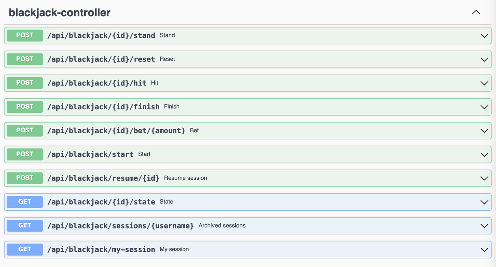

# Blackjack Client

Connects to a RESTful Blackjack server to play blackjack.

`BlackjackClient.java` is a simple command line client.

`BlackjackClientGUI.java` is a framework for building a simple GUI client.

You can try to build a "headless" client that counts cards and plays the game for you. (Headless means no GUI). This can play 100 or 1,000 or 10,000 hands for you to test out various card counting strategies.

Or you can build a GUI client that looks great and provides a great user experience. (If you want the GUI can also count cards, but probably should not play the game for you.)

## Server commands
Our server is behind the campus firewall so you can only see it on campus.

You can see the full API here:

http://euclid.knox.edu:8080/api/blackjack/swagger-ui/index.html

Again, this only works on campus.

Here is the REST API:


Remember that the {id} in the URL is the session id of the game you are playing.

The username and password are in the file `accounts.txt` with the assignment on Google Classroom. This is NOT your email password. The level of security we need here is really low; basically just a simple way for me to keep your sessions separate on the server, make sure that each person's client can connect, and ensure that your projects don't get in each other's way.

## Starting and playing a game
So this URL as a post would start a new session:

```
http://euclid.knox.edu:8080/api/blackjack/start?username=superman&password=12347
```

And you would get back a JSON file that looks something like this for a new game:
```json
{
  "sessionId": "fb2e4f1c-0aa4-4157-96b5-4692f47cc801",
  "playerCards": [],
  "playerValue": 0,
  "dealerCards": [],
  "dealerValue": 0,
  "phase": "BETTING",
  "outcome": null,
  "balance": 0,
  "currentBet": 10,
  "canHit": false,
  "canStand": false,
  "gameOver": false,
  "cardsRemaining": 52,
  "reShuffled": false
}
```

It might look like this after betting:

```json
{
  "sessionId": "fb2e4f1c-0aa4-4157-96b5-4692f47cc801",
  "playerCards": ["TWO OF CLUBS", "TEN OF SPADES"],
  "playerValue": 12,
  "dealerCards": ["JACK OF HEARTS", "???"],
  "dealerValue": null,
  "phase": "PLAYER_TURN",
  "outcome": null,
  "balance": 0,
  "currentBet": 50,
  "canHit": true,
  "canStand": true,
  "gameOver": false,
  "cardsRemaining": 48,
  "reShuffled": false
}
```

After a game is resolved (i.e. the player has won, lost, or pushed), the JSON file might look like this:

```json
{
  "sessionId": "fb2e4f1c-0aa4-4157-96b5-4692f47cc801",
  "playerCards": ["TWO OF CLUBS", "TEN OF SPADES", "SIX OF HEARTS"],
  "playerValue": 18,
  "dealerCards": ["JACK OF HEARTS", "NINE OF DIAMONDS"],
  "dealerValue": 19,
  "phase": "RESOLVED",
  "outcome": "DEALER_WINS",
  "balance": -50,
  "currentBet": 50,
  "canHit": false,
  "canStand": false,
  "gameOver": true,
  "cardsRemaining": 47,
  "reShuffled": false
}
```

## Game Phases and outcomes
The response from the server a **phase** variable that tells you what phase of the game you are in. Possible values are:
- `BETTING`
- `PLAYER_TURN`
- `DEALER_TURN`
- `RESOLVED`

`RESOLVED` means the game is over and there is an outcome.

Possible values for `outcome` are:
- `PLAYER_WINS`
- `DEALER_WINS`
- `PUSH`

From the `RESOLVED` phase, you need to invoke the `reset` call to start a new game. This puts you back into the `BETTING` phase.

## `ClientConnector.java`
The file `ClientConnector.java` handles all of the
communication with the server. It converts the JSON
response into an instance of the `GameState` class.

`GameState.java` is a simple Java class that holds the state of the game. It has getters and setters for all of the variables in the JSON response. It also has a `toString()` method that prints out the state of the game in a readable format.

So you can use the `ClientConnector` class to send commands to the server and get back the state of the game as a `GameState` object.

This means you are using RPC (Remote Procedure Call) to communicate with the server, but you don't really need to know that. You just need to know how to use the `ClientConnector` class.